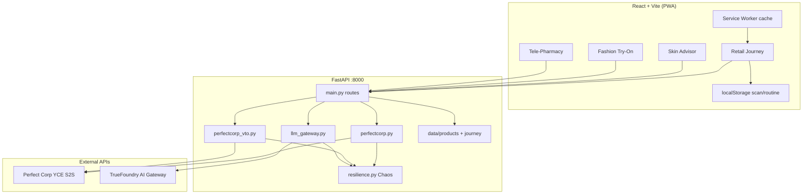

# ResiliAR

**Resilient AI commerce for emerging markets** — skin health analysis, AR fashion try-on, and tele-pharmacy triage that keep working when APIs fail, LLMs brown out, or connectivity drops.

Built for the **DevNetwork AI+ML Hackathon 2026** (Perfect Corp + TrueFoundry sponsor tracks).

> Every other AI beauty or health app is built for someone in San Francisco with 5G. We built for someone in Lagos with 2G — and made it work anyway.

---

## Table of contents

- [Why ResiliAR](#why-resiliar)
- [Features](#features)
- [Architecture](#architecture)
- [Resilience model](#resilience-model)
- [Tech stack](#tech-stack)
- [Prerequisites](#prerequisites)
- [Quick start](#quick-start)
- [Environment variables](#environment-variables)
- [API reference](#api-reference)
- [Demo script (judges)](#demo-script-for-judges)
- [Project structure](#project-structure)
- [Frontend UX](#frontend-ux)
- [Offline & PWA](#offline--pwa)
- [Hackathon deliverables](#hackathon-deliverables)
- [License & disclaimers](#license--disclaimers)

---

## Why ResiliAR

Emerging-market shoppers often hit unreliable networks, expensive data, and flaky third-party APIs. ResiliAR treats **degradation as a first-class feature**:

- **Visible fallback chains** on every AI call so judges and users see exactly what happened.
- **Offline-capable skin analysis** when Perfect Corp is down or unconfigured.
- **Multi-model LLM routing** via TrueFoundry with automatic model failover.
- **Chaos mode** to simulate outages live without redeploying.
- **Region-aware product catalogues** and a guided retail journey (scan → routine → try-on → save/share → care chat).

---

## Features

| Area | What it does | Primary integration | When it fails |
|------|----------------|---------------------|---------------|
| **Retail Journey** | End-to-end flow: selfie scan → AM/PM routine with “why” labels → live AR try-on → save/share → tele-pharmacy | Perfect Corp + curated catalogue | Cached scan, demo preview, offline triage |
| **Skin Health Advisor** | Condition scores (acne, dryness, hyperpigmentation, etc.) + product matches | [Perfect Corp Skin Analysis API](https://yce.perfectcorp.com/) | Offline cached model + `localStorage` |
| **Fashion Try-On** | Virtual fitting room; journey suggests garment from scan | Perfect Corp **Clothes API** (`/api/fashion/try-on-live`) | Demo preview from user photo; classic stub queue |
| **Tele-Pharmacy Triage** | OTC-oriented Q&A with scan + product context | [TrueFoundry AI Gateway](https://www.truefoundry.com/docs/ai-gateway/intro-to-llm-gateway) (OpenAI-compatible) | Model chain → offline cached replies |
| **Chaos Mode** | One toggle blocks primary Perfect Corp + primary LLM | Settings sheet in app | Demonstrates full fallback paths |

### Retail Journey (default tab)

1. **Scan** — Camera or gallery upload; Perfect Corp skin task (upload → create task → poll).
2. **Routine** — Region selector (Pan-Africa, West Africa, South Asia, Latin America); AM/PM products with `why` explanations tied to detected conditions.
3. **Try-on** — Live cloth task using garment reference URLs from the catalogue; falls back to inline demo preview of the user’s photo.
4. **Save** — Persist routine to `localStorage`; copy/share summary; jump to Care tab.

Scan results and journey plans flow into **Skin**, **Style**, and **Care** tabs via shared app state.

---

## Architecture



**Request flow (skin analyze):**

```
Upload image → perfectcorp.analyze_skin()
  → [chaos?] offline mock
  → [no API key?] offline mock
  → upload file → create task → poll → normalize
  → on error → offline mock
→ recommend_for_conditions() + build_journey_plan()
→ JSON: source, analysis, recommendations, journey, fallback_chain
```

---

## Resilience model

Every integration returns a **`source`** label and a **`fallback_chain`** (ordered steps). The UI renders this via `FallbackChain` so failures are transparent, not silent.

### Perfect Corp (skin)

| Step | Outcome |
|------|---------|
| Chaos / missing key / API error | `offline_cache` — deterministic mock conditions + summary |
| Success | `perfect_corp` — normalized concerns from task results |

Retries: `tenacity` (3 attempts, exponential backoff) on upload and task creation.

### Perfect Corp (fashion)

| Endpoint | Behavior |
|----------|----------|
| `POST /api/fashion/try-on` | Stub / queue semantics for classic demo |
| `POST /api/fashion/try-on-live` | Full cloth pipeline: upload person → task with `ref_file_url` + `garment_category` → poll → result URL or **demo preview** (base64 data URL of user photo) |

### TrueFoundry (triage)

Models tried in order: `TFY_MODEL`, then `TFY_FALLBACK_MODELS` (comma-separated). Chaos mode skips the primary model. If all fail or gateway is unset → `offline_cache` templated OTC guidance using scan context.

### Chaos mode

`POST /api/chaos` with `{ enabled, kill_perfect_corp, kill_primary_llm }`. When enabled (default UI toggle sets both kills to `true`):

- Skin + live try-on → offline / demo paths
- Triage → skips primary LLM, uses fallbacks then offline

State is in-memory on the server (`services/resilience.py`).

---

## Tech stack

| Layer | Choices |
|-------|---------|
| **Frontend** | React 19, TypeScript, Vite 8, Tailwind CSS 4, native `fetch` |
| **Backend** | Python 3.11+, FastAPI, Uvicorn, Pydantic v2 |
| **HTTP client** | `requests` (Perfect Corp), `openai` SDK (TrueFoundry gateway) |
| **Resilience** | `tenacity`, custom `FallbackChain`, chaos flags |
| **Persistence (client)** | `localStorage` (`resiliar_last_skin`, `resiliar_saved_routine`) |
| **PWA** | `public/sw.js` — cache-first shell for GET assets |

---

## Prerequisites

- **Python** 3.11+ (3.10+ should work)
- **Node.js** 20+ and npm
- **Webcam** or sample images for demo (HTTPS not required locally; use gallery upload if camera blocked)
- Optional API keys (app runs in degraded demo mode without them):
  - Perfect Corp YCE API key
  - TrueFoundry AI Gateway key + base URL

---

## Quick start

### 1. Clone and configure

```bash
git clone <your-repo-url>
cd resilskinAi
cp .env.example .env
```

Edit `.env` at the **repository root** (backend loads `ROOT.parent / ".env"`).

**Perfect Corp:** Redeem hackathon code `Pegasus1000` at the [YCE API Console](https://yce.perfectcorp.com/api-console/en/redeem-code/), then create an API key.

**TrueFoundry:** Create an [AI Gateway](https://www.truefoundry.com/docs/ai-gateway/intro-to-llm-gateway) deployment and set `TRUEFOUNDRY_BASE_URL` to your OpenAI-compatible base (e.g. `.../api/llm/openai`).

### 2. Backend

```bash
cd backend
python -m venv venv
source venv/bin/activate   # Windows: venv\Scripts\activate
pip install -r requirements.txt
uvicorn main:app --reload --port 8000
```

Verify: [http://127.0.0.1:8000/health](http://127.0.0.1:8000/health) — shows integration flags and chaos state.

Interactive docs: [http://127.0.0.1:8000/docs](http://127.0.0.1:8000/docs)

### 3. Frontend

```bash
cd frontend
npm install
npm run dev
```

Open [http://localhost:5173](http://localhost:5173). Vite proxies `/api` and `/health` to port `8000`.

**Production build:**

```bash
cd frontend && npm run build && npm run preview
```

Set `VITE_API_URL` if the API is on another host (defaults to same-origin / proxy).

---

## Environment variables

| Variable | Required | Description |
|----------|----------|-------------|
| `PERFECT_CORP_API_KEY` | No* | Bearer token for YCE S2S API |
| `PERFECT_CORP_BASE_URL` | No | Default: `https://yce-api-01.makeupar.com/s2s/v2.0` |
| `TRUEFOUNDRY_API_KEY` | No* | Gateway API key |
| `TRUEFOUNDRY_BASE_URL` | No* | OpenAI-compatible gateway base URL |
| `TFY_MODEL` | No | Primary model (default: `claude-sonnet-4-20250514`) |
| `TFY_FALLBACK_MODELS` | No | Comma-separated fallbacks (default: `gpt-4o,gemini-1.5-pro`) |
| `VITE_API_URL` | No | Frontend API prefix (empty = use Vite proxy) |

\*Without keys, skin and try-on use offline/demo paths; triage uses offline cached replies.

---

## API reference

| Method | Path | Description |
|--------|------|-------------|
| `GET` | `/health` | Status, chaos state, integration configured flags |
| `GET` | `/api/chaos` | Current chaos flags |
| `POST` | `/api/chaos` | Body: `{ enabled, kill_perfect_corp?, kill_primary_llm? }` |
| `GET` | `/api/products/skin` | Curated skin catalogue |
| `GET` | `/api/products/fashion` | Fashion items + Perfect Corp ref URLs |
| `GET` | `/api/journey/regions` | Region list for routine filtering |
| `POST` | `/api/journey/plan` | Body: `{ conditions, recommendations?, region }` → journey plan |
| `POST` | `/api/skin/analyze` | `multipart/file` → analysis + recommendations + journey |
| `POST` | `/api/fashion/try-on` | `multipart/file` + `garment_id` query → stub try-on |
| `POST` | `/api/fashion/try-on-live` | `multipart/file` + `garment_id` → live cloth task |
| `POST` | `/api/triage` | JSON: `{ message, history?, skin_context? }` → reply + chain |

**Example — triage:**

```bash
curl -s http://127.0.0.1:8000/api/triage \
  -H "Content-Type: application/json" \
  -d '{"message":"Is SPF enough for hyperpigmentation?","history":[],"skin_context":{"conditions":[{"name":"hyperpigmentation"}]}}'
```

---

## Demo script (for judges)

Recommended order (~5–7 minutes):

1. **Home (Retail Journey)** — Take a selfie; show fallback chain if API key missing or after enabling chaos. Walk through AM/PM routine and “why” labels; change region and note catalogue filtering.
2. **Try-on step** — Live AR preview (or demo preview under chaos); mention garment picked from scan (`suggested_garment_id`).
3. **Save & share** — Save routine locally; copy share text; open **Care** tab.
4. **Scan tab** — Repeat or deepen analysis view; skin score pill in header updates.
5. **Style tab** — Try another garment; show `preferLive` path and chain.
6. **Care tab** — Ask about recommended products; point out TrueFoundry model in `meta` / fallback chain.
7. **Settings → Resilience demo** — Enable chaos; re-run scan and chat; show offline skin model, demo try-on preview, and LLM failover/offline triage.

**Talking points:** visible chains, emerging-market regions, OTC-only triage disclaimer, PWA + local cache for spotty networks.

---

## Project structure

```
resilskinAi/
├── .env.example              # Root env template (loaded by backend)
├── README.md
├── backend/
│   ├── main.py               # FastAPI app & routes
│   ├── requirements.txt
│   ├── data/
│   │   ├── products.py       # SKIN_PRODUCTS, FASHION_ITEMS, recommend_for_conditions
│   │   └── journey.py        # Regions, routines, why-labels, garment hints
│   └── services/
│       ├── perfectcorp.py    # Skin analysis + classic try-on stub
│       ├── perfectcorp_vto.py# Live Clothes API try-on
│       ├── llm_gateway.py    # TrueFoundry multi-LLM triage
│       └── resilience.py     # Chaos mode + FallbackChain helper
└── frontend/
    ├── index.html
    ├── vite.config.ts        # Dev proxy → :8000
    ├── public/
    │   └── sw.js             # Service worker (offline shell)
    └── src/
        ├── App.tsx           # Tab state, skin context, SW register
        ├── lib/
        │   ├── api.ts        # HTTP + localStorage helpers
        │   └── tooltips.ts   # In-app guidance copy
        ├── types.ts
        └── components/
            ├── layout/
            │   ├── AppShell.tsx      # Header, bottom nav, settings modal
            │   └── StepIndicator.tsx
            ├── ui/                   # Icons, Tooltip, InfoTip, LoadingSpinner
            ├── RetailJourney.tsx
            ├── SkinAdvisor.tsx
            ├── FashionTryOn.tsx
            ├── TelePharmacy.tsx
            ├── CameraCapture.tsx
            ├── ChaosPanel.tsx
            └── FallbackChain.tsx
```

---

## Frontend UX

| Tab | Nav label | Role |
|-----|-----------|------|
| `journey` | Home | Full retail funnel with step indicator |
| `skin` | Scan | Standalone skin advisor |
| `fashion` | Style | Garment picker + live try-on |
| `triage` | Care | Chat; enriched when `skinContext` exists from last scan |

**Shared state:** Last scan lives in React state + `localStorage`; garment suggestion and triage context propagate across tabs.

**Tooltips:** `InfoTip` / `Tooltip` components explain scores, regions, chaos mode, and medical disclaimer (OTC only, not a diagnosis).

---

## Offline & PWA

- **Service worker** (`frontend/public/sw.js`): caches `/` and `/index.html`; network-first with cache fallback for GET requests.
- **Skin cache:** Last analysis stored under `resiliar_last_skin` for instant reload.
- **Saved routine:** `resiliar_saved_routine` on device.
- **Backend offline paths:** Mock skin analysis, demo try-on preview (base64), templated triage — no separate ML model file; deterministic stubs for demo reliability.

---

## Hackathon deliverables

| Item | Status |
|------|--------|
| Working web app (React + Vite + FastAPI) | Done |
| Perfect Corp skin analysis + live clothes try-on | Done |
| TrueFoundry gateway routing + visible fallback chain | Done |
| Chaos mode for live judging | Done |
| Region-aware journey + product “why” labels | Done |
| Devpost page + demo video | Team |

### Sponsor alignment

- **Perfect Corp:** Skin Analysis API (`/file/skin-analysis`, `/task/skin-analysis`) and Clothes API (`/file/cloth`, `/task/cloth`) with reference garment images.
- **TrueFoundry:** OpenAI-compatible gateway; primary + fallback models; usage metadata on success.

---

## License & disclaimers

- **Not medical advice.** Tele-pharmacy triage is for OTC education and triage only; severe or spreading symptoms require a clinician.
- **Skin scores** come from Perfect Corp or offline mock data — not a clinical diagnosis.
- **API keys** belong in `.env` only; never commit secrets (see `.gitignore`).

---

## Contributing / extending

- Add products in `backend/data/products.py`; journey logic auto-picks AM/PM and garment hints in `journey.py`.
- Add frontend env for staging: `VITE_API_URL=https://your-api.example.com`.
- For new LLM providers, extend `llm_gateway.py` — the OpenAI client pattern maps to any compatible gateway.

Questions or demo issues: check `/health`, browser devtools Network tab, and the **fallback chain** panel on each feature screen.
